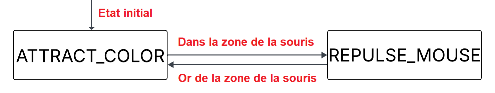

# 🐦 Boids + State Machine & 🧭 Dijkstra + A* Pathfinding
Interactive visualizations in **Python + Pygame**

<p align="center">
  
  
  
  
  
</p>

---

Two independent but related projects:

- 🐦 **Boids + State Machine**: advanced simulation of multi-colored flocks, compatible with **Wallpaper Engine** via `.exe` executable.
- 🧭 **Dijkstra + A\***: maze generation and visual comparison of pathfinding algorithms.

---

# 🐦 1. Boids + State Machine

Simulation of a flock of colored "boids" controlled by a state machine.

## 🎮 Features
- Flocking behavior: boids are attracted to other boids of the same color  
- Each boid has states:  
  - `ATTRACT_COLOR`  
  - `REPULSE_MOUSE`
- Repulsion from the mouse  
- Color change when colliding with colored bars  
- Particle effects and colorful bar regions  
- Interactive controls:  
  - Left click on a color bar → spawn boids  
  - Left click outside bars → destroy boids  

## ⚙️ State Machine

The state machine in Boids + State Machine governs the behavior of each individual boid. Each boid dynamically switches between different states based on its environment and interactions:

ATTRACT_COLOR: The boid is attracted to other boids of the same color and moves toward its designated color bar.

REPULSE_MOUSE: When the mouse comes close, the boid temporarily switches to repulsion mode, moving away from the cursor.

This modular approach allows each boid to make autonomous decisions, creating realistic flocking behavior while responding to user interactions. The state machine ensures smooth transitions between attraction, repulsion, and collision-based color changes, producing visually dynamic and emergent flocking patterns.

## 🖼️ Wallpaper Engine Usage
The project can be compiled into a **borderless fullscreen `.exe`**, suitable for Wallpaper Engine.

### ✔ Build Executable
From `Boids+StateMachine/`:
``` python
pyinstaller --onefile Boids+StateMachine.py
```

The `.exe` will appear in:

Boids+StateMachine/dist/Boids+StateMachine.exe

Add it in Wallpaper Engine → **Local application** → select the EXE.

---

# 🧭 2. Dijkstra + A* Pathfinding

Visual comparison of two classic pathfinding algorithms.

## 🧩 Functionality
1. Generate a **perfect maze** using recursive backtracking  
2. Visualize **Dijkstra's algorithm**  
3. Pause briefly  
4. Visualize **A\*** (Manhattan heuristic)  
5. Display execution times  
6. Left click → generate a new maze

## 🎨 Visualization
- Open set: light blue  
- Closed set: purple  
- Final path: yellow  
- Start / Goal: green / red  

# 🚀 Installation

### 1. Install dependencies
``` python
pip install pygame
```

### 2. Run the scripts
``` python
python Boids+StateMachine/Boids+StateMachine.py
python djikstra+AStar/djikstra+AStar.py
```

# 🤝 Credits
- [Journoud Lucas](https://github.com/Journoud-Lucas) - Has created the project
- Didier Puzenat - My AI professor for whom I created this repo

# 📄 License
This software is under the Unlicense, terms of which are available in [UNLICENSE.txt](UNLICENSE.txt])
