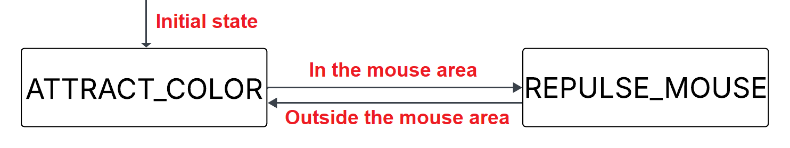

# 🐦 Boids + State Machine & 🧭 Dijkstra + A* Pathfinding & 🧬 Genetic Algorithm
Interactive visualizations in **Python + Pygame**

<p align="center">
  
  
  
  
  
</p>

---

Three independent but related projects:
- 🐦 **Boids + State Machine**: advanced simulation of multi-colored flocks, compatible with **Wallpaper Engine** via `.exe` executable.
- 🧭 **Dijkstra + A\***: maze generation and visual comparison of pathfinding algorithms.
- 🧬 **Genetic Algorithm**: evolutionary simulation of creatures learning to reach a target through obstacles.

---

# 🐦 1. Boids + State Machine

Simulation of a flock of colored "boids" controlled by a state machine.

## 🎮 Features

- Flocking behavior: boids are attracted to other boids of the same color  
- Each boid has states:  
  - `ATTRACT_COLOR`  
  - `REPULSE_MOUSE`
- Repulsion from the mouse  
- Color change when colliding with colored bars  
- Particle effects and colorful bar regions  
- Interactive controls:  
  - Left click on a color bar → spawn boids  
  - Left click outside bars → destroy boids  

## ⚙️ State Machine



The state machine in Boids + State Machine governs the behavior of each individual boid. Each boid dynamically switches between different states based on its environment and interactions:

ATTRACT_COLOR: The boid is attracted to other boids of the same color and moves toward its designated color bar.

REPULSE_MOUSE: When the mouse comes close, the boid temporarily switches to repulsion mode, moving away from the cursor.

This modular approach allows each boid to make autonomous decisions, creating realistic flocking behavior while responding to user interactions. The state machine ensures smooth transitions between attraction, repulsion, and collision-based color changes, producing visually dynamic and emergent flocking patterns.

## 🖼️ Wallpaper Engine Usage

The project can be compiled into a **borderless fullscreen `.exe`**, suitable for Wallpaper Engine.

### ✔ Build Executable

From `Boids+StateMachine/`:

``` python
pyinstaller --onefile Boids+StateMachine.py
```

The `.exe` will appear in:

Boids+StateMachine/dist/Boids+StateMachine.exe

Add it in Wallpaper Engine → **Local application** → select the EXE.

---

# 🧭 2. Dijkstra + A* Pathfinding

Visual comparison of two classic pathfinding algorithms.

## 🧩 Functionality

1. Generate a **perfect maze** using recursive backtracking  
2. Visualize **Dijkstra's algorithm**  
3. Pause briefly  
4. Visualize **A\*** (Manhattan heuristic)  
5. Display execution times  
6. Left click → generate a new maze

## 🎨 Visualization

- Open set: light blue  
- Closed set: purple  
- Final path: yellow  
- Start / Goal: green / red  

---

# 🧬 3. Genetic Algorithm

Simulation of creatures evolving through generations to reach a target while avoiding obstacles.

## 🧬 Features

- **Population-based evolution**: 100 creatures per generation
- **DNA encoding**: each creature has 300 genes representing movement directions
- **Fitness function**: rewards reaching the target quickly and penalizes collisions
- **Selection**: tournament selection of the fittest individuals
- **Crossover**: combines DNA from two parents to create offspring
- **Mutation**: random modifications to explore new solutions
- **Elitism**: preserves the 5 best creatures across generations
- Real-time statistics and generation tracking

## 🎮 Controls

- **Left Click**: move the target to a new location
- **Space**: pause/resume the simulation
- **R**: reset and restart from generation 1
- **+/-**: increase/decrease mutation rate
- **↑/↓**: adjust simulation speed

## 🧠 How it Works

Each creature:
1. Follows its DNA (sequence of movement angles)
2. Dies if it hits a wall or obstacle
3. Succeeds if it reaches the target
4. Gets a fitness score based on performance

Each generation:
1. All creatures are evaluated
2. The best performers are selected
3. They reproduce (crossover + mutation)
4. A new generation is born with improved DNA

Over time, creatures learn to navigate around obstacles and find efficient paths to the target!

## 🎨 Visualization

- **Gray creatures**: dead (collision)
- **Colored creatures**: alive and moving
- **Golden creatures**: successfully reached the target
- **Green circle**: starting point
- **Red circle**: target destination
- **Gray bars**: obstacles to avoid

---

# 🚀 Installation

### 1. Install dependencies

``` python
pip install pygame
```

### 2. Run the scripts

``` python
python Boids+StateMachine/Boids+StateMachine.py
python djikstra+AStar/djikstra+AStar.py
python GeneticAlgorithm/genetic_algorithm.py
```

---

# 🤝 Credits

- [Journoud Lucas](https://github.com/Journoud-Lucas) - Has created the project
- Didier Puzenat - My AI professor for whom I created this repo

---

# 📄 License

This software is under the Unlicense, terms of which are available in [LICENSE](LICENSE)
